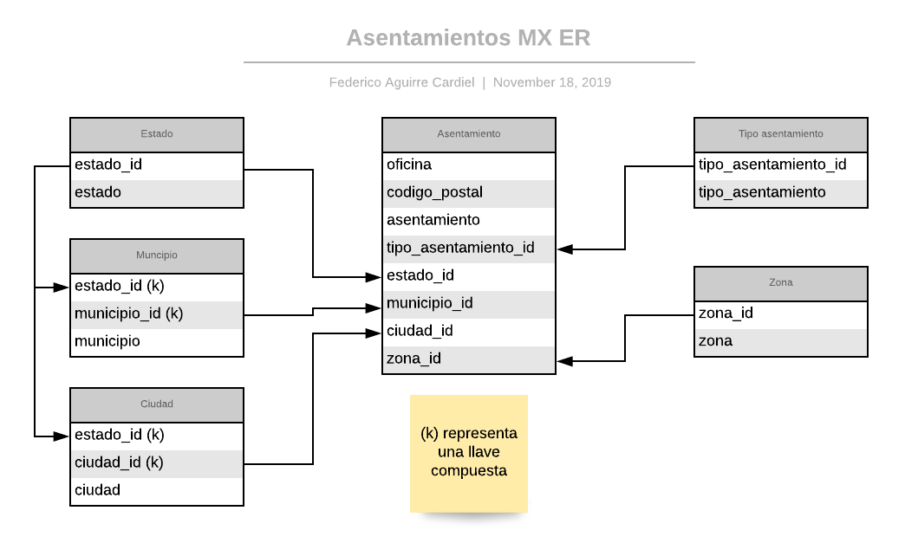

# r-cp-mx
Conjunto de datos normalizados en R de los códigos postales mexicanos.

## Propósito

Este proyecto tiene el propósito de generar un conjunto de datos normalizado,
en archivos csv, que tenga catálogos que se puedan utilizar en el análisis de datos.

Correos mexicanos permite descargar los códigos postales del país a través
del siguiente link: [Códigos postales](https://www.correosdemexico.gob.mx/SSLServicios/ConsultaCP/CodigoPostal_Exportar.aspx).

Adicionalmente muestra el uso de [Leaflet](https://leafletjs.com/) y ggplot2 en R para visualizar datos geográficos.

## Conjunto de Datos

El conjunto de datos que se deriva de la descarga es el siguiente:

  - [Estado](./cp-db/estado.csv)
  - [Municipio](./cp-db/municipio.csv)
  - [Ciudad](./cp-db/ciudad.csv)
  - [Zona](./cp-db/zona.csv)
  - [Tipos de asentamiento](./cp-db/tipo_asentamiento.csv)
  - [Asentamiento (y CPs)](./cp-db/asentamiento.csv)

## Donaciones

Si este material te fue de ayuda puedes donar a mi cuenta de [Paypal](https://paypal.me/FAguirreCardiel).

## Datos de contacto

Mi nombre es [Federico Aguirre](mailto:federico.aguirre.cardiel@gmail.com).

  - [LinkedIn](https://www.linkedin.com/in/federicoaguirrec)
  - [Progamando chácharas - Blogspot](http://programandochacharas.blogspot.com/)
  - [Twitter](https://twitter.com/FAguirreCardiel)
  - [Github](https://github.com/FedericoAguirre/)

## Copyright y licencia

Copyright 2019 [Federico Aguirre](https://www.linkedin.com/in/federico-aguirre-4199933/).
Código liberado bajo la licencia [Apache License](./LICENSE).
